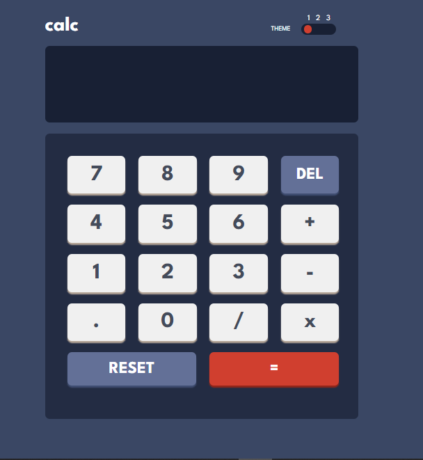

# Frontend Mentor - Calculator app solution

This is a solution to the [Calculator app challenge on Frontend Mentor](https://www.frontendmentor.io/challenges/calculator-app-9lteq5N29). Frontend Mentor challenges help you improve your coding skills by building realistic projects. 

## Table of contents

- [Overview](#overview)
  - [The challenge](#the-challenge)
  - [Screenshot](#screenshot)
  - [Links](#links)
- [My process](#my-process)
  - [Built with](#built-with)
  - [What I learned](#what-i-learned)
  - [Useful resources](#useful-resources)
- [Author](#author)

## Overview

### The challenge

Users should be able to:

- See the size of the elements adjust based on their device's screen size
- Perform mathmatical operations like addition, subtraction, multiplication, and division
- Adjust the color theme based on their preference
- **Bonus**: Have their initial theme preference checked using `prefers-color-scheme` and have any additional changes saved in the browser

### Screenshot

### Links

- Solution URL: https://basic-calculator-app-ten.vercel.app/

## My process

- I built the skeleton structure using HTML 
- The calculator was styled using CSS including the buttons grid, display bar and theme toggle
- The theme toggling effect was implemented using CSS with Javascript to trigger the functionality
- The calculator main functionality was bulit using Javascript ES6 classes
- I created a calculator class with two properties; firstInput and secondInput
- In this classes they are methods defined to carry out certain oprations when triggered
- The methods are below:

- addInput() - this accepts input when a number button is clicked
- operation() - this gets the operation to be triggered
- computation() this computes the inputs passed unto the calculator
- delete() - this deletes a single character at the end of an input
- resetAll() this clears the entire input
- updateDisplay() - this displays the input on the display bar

- I created a calculator object with the properties

- The DOM of all buttons to be used was gotten.
- Event listener was passed out to each button depending on the function it is carrying out.

### Built with

- Semantic HTML5 markup
- CSS custom properties
- Flexbox
- CSS Grid
- Javascript

### What I learned
- I was able to utilize and learn some intricacies of the Javascript ES6 class.

### Continued development

### Useful resources
https://www.section.io/engineering-education/building-a-calculator-a-javascript-project-for-beginners/

## Author

- Kuyooro Praise 
- Twitter - https://twitter.com/OlaKuyooro

